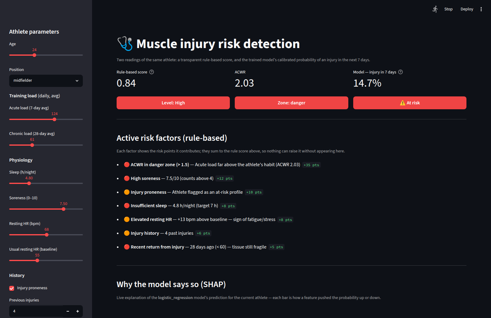

# 🩺 Athlete Injury Risk Detection

[](https://github.com/Amayyas/athlete-injury-risk-detection/actions/workflows/ci.yml)
[](https://www.python.org/downloads/)
[](LICENSE)

Detecting **muscle injury risk** in athletes from training metrics (workload, RPE)
and physiological signals (sleep, heart rate, soreness), with **full explainability
via SHAP** so the output is usable by a sports medical staff — not just a black box.



> *Streamlit dashboard: risk score computed in real time (here an athlete in the
> danger zone), active risk factors and built-in SHAP explainability.*

---

## 🎯 Goal & design choices

Answer the question a medical staff actually asks:

> **Is this athlete about to get injured in the next 7 days?**

grounded in the real domain knowledge used by strength & conditioning staff. The
project rests on 3 pillars:

1. **Real domain knowledge** — use of the **ACWR** (*Acute:Chronic Workload
   Ratio*), a metric actually used by staff: optimal zone **0.8–1.3**, danger
   zone **> 1.5**.
2. **Explainability (SHAP)** over raw *accuracy* — in a medical context,
   **recall** (not missing an injury) matters more than overall precision. That is not
   a slogan here: a miss costs **10×** a false alarm, and the decision threshold is
   derived from that number rather than left at 0.5 (see below).
3. **A visual, interactive deliverable** — a **Streamlit** dashboard, not just a notebook.

Alongside the model, a rule-based **composite risk score** (low / moderate / high)
powers the dashboard's live assessment — and doubles as the **baseline the model has
to beat**.

---

## 🗃️ Data: transparency & limitations

An **audit of the 4 candidate Kaggle datasets** was done before any processing:

| Dataset | Size | Target | Balance | Temporal? | Kept |
|---|---|---|---|---|---|
| `mrsimple07` injury-prediction | 1000 × 7 | binary | 50/50 (suspicious) | ❌ snapshot | no |
| university-football-injury | 800 × 19 | binary | 50/50 (suspicious) | ❌ snapshot | no |
| EPL player-injuries-impact | 656 × 42 | no risk target | — | match history | no |
| **SIRP-600** | **600 × 16** | binary | **68/32 (natural)** | ❌ snapshot | ✅ |

### ⚠️ Key finding

**No available real dataset contains a per-athlete daily time series.** Yet ACWR
and the 7/14/28-day *rolling features* need one. Hence a deliberate **dual-track**
strategy:

- **🧪 Synthetic track (primary)** — a generator simulates 200 athletes × 730 days
  with **actual injury events** (see below). The only basis allowing a realistic
  temporal ACWR, and a genuinely predictive task.
- **🌍 Real SIRP-600 track (validation)** — demonstrates the same approach on
  **real, imperfect data** that is naturally imbalanced. Limitations: *snapshot*
  (no ACWR possible) and a target that is a risk *label*, not an observed injury.

---

## 🎯 The target: a real predictive task

**This is the most important design decision in the project, and it was originally
wrong.**

The first version of the generator labelled each day by discretising the rule-based
`composite_risk_score` **of that same day**, then trained the model on the very
variables that score was computed from. The model was not predicting injuries — it
was **re-learning the scoring function**. Its accuracy measured how well XGBoost can
imitate a formula. The whole result was circular.

### What it does now

The rules no longer *are* the label; they drive a **discrete-time logistic hazard**:

```
logit( P(injury on day t) ) = intercept + slope · latent_risk(t)
```

Each day, an athlete may actually get injured. An injured athlete is **sidelined**
for a recovery period, comes back with `previous_injuries` incremented and
`days_since_injury` reset — which feeds back into their future risk, exactly as in
real life.

The target becomes an **observed outcome**:

> **`injury_next_7d`** — will this athlete get injured within the next 7 days,
> given everything known up to (and including) today?

| | before | now |
|---|---|---|
| Target | rule score of the same day | an **observed injury event** |
| Relationship to features | deterministic (+ noise) | **stochastic** |
| What the model learns | the formula it was given | a real, noisy signal |
| Positive rate | 8% (by threshold choice) | **~5%** (by simulation) |

Injuries land at **~1.3 per athlete per season**, athletes are sidelined ~13% of
days, and the target is positive on ~5% of modellable athlete-days.

### Calibrating the hazard honestly

The intercept and the slope are separated on purpose: the **intercept sets the base
rate**, the **slope sets how much risk actually predicts injury**. A naive
multiplicative hazard cannot separate the two — keeping a realistic injury rate
forces a high base, so most injuries fall on low-risk days and the signal drowns. In
that first attempt, even a model that *knew the true latent risk* only reached
ROC-AUC 0.57: **the task was unlearnable by construction**, and no algorithm could
have saved it.

The slope is now calibrated so the signal is real but far from perfect — which is
what injury prediction actually looks like.

**Rows that cannot be modelled are dropped**, not silently kept: the ACWR warm-up,
days the athlete is *already* injured (they are not exposed to a *new* injury), and
the censored tail whose 7-day horizon runs past the end of the simulation.

**Limitations to keep in mind:**
- The synthetic hazard is **logit-linear in the latent risk by construction**. That
  is a strong hint the data-generating process gives to linear models — and the
  benchmark below shows exactly that. It is a property of the simulation, not
  evidence about injury prediction in the real world.
- SIRP-600 yields very high scores (roc_auc ≈ 0.96), suggesting strongly separable
  features (dataset possibly partly generated) — flagged as a limitation rather than
  oversold. Its target is a risk *label*, not an observed injury.

---

## 🧠 ML pipeline

1. **Feature engineering** (`features/engineering.py`): 7/14/28-day rolling windows,
   **ACWR + zone**, workload trend, HR delta vs the athlete's own baseline.
2. **Candidates** (`models/candidates.py`): `SMOTE + estimator` pipelines for logistic
   regression, random forest and XGBoost — resampling always *inside* the fold.
3. **Tuning** (`models/tune.py`): randomised search on **PR-AUC**, for **every**
   candidate under the same budget.
4. **Calibration + threshold** (`models/train.py`): isotonic calibration, then a
   decision threshold derived from the **cost of being wrong**.
5. **Explainability** (`visualization/shap_plots.py`): explainer chosen from the model
   (`LinearExplainer` / `TreeExplainer`).
6. **Dashboard** (`dashboard/app.py`): live rule-based score and its decomposition.

### ⚠️ Three leakage guarantees, all tested

- **No athlete spans a split** — `StratifiedGroupKFold` on `athlete_id` (200 groups).
- **No feature sees the future** — a test corrupts every day after a cutoff and
  asserts not one prior feature moves.
- **Calibration keeps the grouping** — `CalibratedClassifierCV` silently *drops*
  `groups`, so its folds are precomputed per outer fold in a proper **nested** CV.
  That one would have quietly reintroduced the leakage this project already fixed.

And the hazard driver (`latent_risk`) is never a feature.

### Model selection: measured, not assumed

Every candidate was tuned under the **same budget and protocol** — because a tuned
favourite against untuned baselines measures which model got attention, not which
model is better.

**Synthetic track** (injury within 7 days, 4.9% positive)

| Model (tuned) | PR-AUC | ROC-AUC |
|---|---|---|
| **Logistic Regression** ✅ | **0.367 ± 0.032** | **0.842 ± 0.012** |
| Random Forest | 0.344 | 0.832 |
| XGBoost | 0.341 | 0.831 |
| *Domain rules (baseline)* | *0.287* | *0.830* |
| *Chance (prevalence)* | *0.049* | *0.500* |

**Real SIRP-600 track** (binary risk label, 31.5% positive)

| Model (tuned) | PR-AUC | ROC-AUC |
|---|---|---|
| **Random Forest** ✅ | **0.957 ± 0.040** | **0.971 ± 0.020** |
| XGBoost | 0.940 | — |
| Logistic Regression | 0.781 | — |
| *Chance (prevalence)* | *0.315* | *0.500* |

**The delivered model differs per track, and that is the finding.** Tuning did not
rescue XGBoost on the synthetic track (0.291 → 0.341, still last); it even pushed the
two complex models *towards simplicity* — the search picked `C = 0.009` for the
logistic regression and `max_depth = 3` for the forest. The synthetic hazard is
**logit-linear by construction**, so the linear model is nearly correctly specified;
that is a property of the simulation, not a claim about injury prediction. On real
data the ranking flips back and trees win.

> Reaching for gradient boosting by default is a reflex, not a decision. Here the
> reflex would have shipped the worst of the three.

### Calibration: a 1-point cost that buys a usable number

SMOTE rebalances the classes to train, which inflates every probability. The raw model
announces **32% average risk** on a population that gets injured **4.9%** of the time:
it ranks well and lies about magnitude.

| Synthetic | PR-AUC (ranking) | Brier (reliability) | Mean predicted |
|---|---|---|---|
| Uncalibrated | 0.362 | 0.132 | 32.4% |
| **Isotonic** | 0.351 | **0.036** | **4.9%** (actual: 4.9%) |

Calibration costs ~1 point of ranking and improves reliability by **72%**. For a staff
being told "20% risk", that trade is not close — an uncalibrated probability is a
number that means nothing.

### The decision threshold comes from a cost, not from 0.5

`0.5` is every classifier's default, and it carries a hidden claim: that a missed
injury and a false alarm cost the same. On a 5% positive class a calibrated model may
never even output 0.5 — so the classifier predicts "safe" for everyone, scores 95%
accuracy, and is useless.

The threshold minimises an explicit expected cost, with **a miss costing 10× a false
alarm** (`config.COST_FALSE_NEGATIVE`) — a business statement anyone can audit and
argue with:

| Synthetic, at t = 0.106 | |
|---|---|
| Recall | **59%** of coming injuries flagged |
| Precision | 33% |
| Alert load | 8.8% of athlete-days |

### 🔎 The ACWR is *not* the top SHAP feature — and that is the interesting part

The project's headline claim used to be "**ACWR is the most decisive variable**". Once
the target became a real injury event, the delivered model's global SHAP ranking put
`injury_prone`, `days_since_injury` and chronic load **ahead of it** — ACWR lands 8th.

That claim was wrong, but the naive reading of it would be wrong too. The data:

| | Injury rate within 7 days | How often it applies |
|---|---|---|
| **ACWR in danger zone** | **28.7%** | only **5.3%** of days |
| ACWR optimal | 1.95% | 76% of days |
| Injury-prone athlete | 8.98% | 30% of athletes, **every day** |
| Not injury-prone | 1.88% | — |

**ACWR remains by far the strongest risk factor**: a ×15 ratio between its danger and
optimal zones, against ×4.8 for proneness. But it *fires rarely*, and global SHAP
importance is a **mean** — it rewards what contributes constantly over what contributes
enormously but occasionally.

So the honest statement is not "ACWR doesn't matter". It is: **ACWR is decisive when it
fires, and it rarely fires.** Athlete profile dominates the average because it is
always on.

Which happens to match the best-established fact in sports medicine — *previous injury
is the strongest predictor of future injury* — and echoes a genuine controversy in the
recent literature about how much the ACWR really predicts.

---

## 🧰 Tech stack

`Python 3.12` · `pandas` · `numpy` · `scikit-learn` · `xgboost` ·
`imbalanced-learn (SMOTE)` · `shap` · `streamlit` · `fastapi` · `pydantic` ·
`matplotlib` · `seaborn` ·
`pytest` · `black` · `ruff`

---

## 📁 Structure

The project is a proper installable package (`src` layout):

```
athlete-injury-risk-detection/
├── data/
│   ├── raw/                  # raw Kaggle datasets (gitignored)
│   └── processed/            # generated synthetic dataset (gitignored)
├── src/
│   └── injury_risk/          # the installable package
│       ├── config.py         # single source of truth (paths, thresholds, weights, CV)
│       ├── api/              # main.py + schemas.py (FastAPI service)
│       ├── data/             # datasets.py (public API), generate_synthetic.py, load_dataset.py
│       ├── features/         # engineering.py (ACWR, rolling) + risk_factors.py (rule scoring)
│       ├── models/           # train.py, tune.py, benchmark.py, splits.py (grouped CV)
│       ├── visualization/    # shap_plots.py
│       └── inference.py      # the serving seam: dashboard + API share it
├── dashboard/                # app.py (Streamlit)
├── tests/                    # pytest tests
├── notebooks/                # 01_eda.ipynb
├── reports/figures/          # generated SHAP plots (gitignored)
├── models/                   # trained .joblib models (gitignored)
├── docs/                     # dashboard screenshot
├── pyproject.toml            # metadata, dependencies, tooling config
├── requirements.txt          # thin pointer to pyproject
├── LICENSE
└── README.md
```

---

## 🚀 Getting started

Everything hangs off **one command**, `injury-risk` (`make help` lists the shortcuts):

```bash
# 1) Environment — installs the `injury_risk` package in editable mode
python3.12 -m venv .venv && source .venv/bin/activate
make setup                    # == pip install -e ".[dev]"

# 2) The whole pipeline: data -> train -> SHAP plots
make pipeline

# 3) Launch the dashboard (works even without a trained model)
make run

# 4) Or serve the REST API — interactive docs at /docs
make serve
```

Or stage by stage:

```bash
injury-risk --help                          # every command, self-documented
injury-risk download sirp-600               # real datasets (needs a Kaggle token)
injury-risk data                            # generate 200 athletes x 730 days
injury-risk benchmark                       # LogReg / RandomForest / XGBoost
injury-risk tune --track synthetic          # hyperparameter search
injury-risk train --tuned                   # train and write the metrics report
injury-risk shap --track synthetic          # explainability plots
injury-risk dashboard                       # Streamlit app
injury-risk serve                           # REST API (OpenAPI docs at /docs)
```

### Reproducible installs

`pyproject.toml` is the single source of truth for dependencies; `requirements.lock`
and `requirements-dev.lock` pin the exact resolved versions (regenerate with
`make lock`).

```bash
pip install -c requirements.lock -e .       # the exact, reproducible versions
```

CI installs **pinned on Python 3.12** — that is the reproducible build the Docker
image and the deployment will use — and **unpinned on 3.13**, on purpose: that leg is
the canary that catches an upstream release breaking us *before* we bump the lock.

### Code quality & tests

```bash
make check        # everything CI runs: lint + types + tests
make test         # tests with their coverage floor
make lint         # ruff + mypy
make format       # black + ruff --fix
make smoke        # guard model quality (fails if the metrics regress)
make notebooks    # execute the notebooks (proves they still run)
make audit        # scan pinned dependencies for known vulnerabilities
make hooks        # install the pre-commit hooks
```

Local **pre-commit** hooks mirror CI (ruff, black, `nbstripout`, `gitleaks`), so lint
errors, committed notebook outputs and leaked secrets are caught before they are pushed
(`make hooks` to install). CI additionally **executes every notebook** — the EDA one
once drifted broken because nothing re-ran it — runs **`pip-audit`** on the pinned set
and **`gitleaks`** over history, and **Dependabot** keeps dependencies and Actions
current.

Lint, types and tests run on every push and pull request via
[GitHub Actions](.github/workflows/ci.yml), on Python 3.12 and 3.13.

### 🛡️ CI guards the model, not only the code

Unit tests prove the pipeline *runs*. They say nothing about whether the model is still
any **good** — a broken feature or a reverted leakage fix leaves every test green while
the model quietly degrades. So a separate [workflow](.github/workflows/ml.yml) runs the
whole pipeline on a small deterministic dataset and checks the metrics:

```
  [PASS] average_precision        0.2745  (expected >= 0.2)
  [PASS] roc_auc                  0.8232  (expected >= 0.78)
  [PASS] lift_over_chance         7.3472  (expected >= 4.0x)
  [PASS] roc_auc_not_suspicious   0.8232  (expected <= 0.95, higher suggests leakage)
```

Three decisions make it worth having:

- **It is sized so the metric is signal, not noise.** At 60 athletes PR-AUC swings
  ±0.093 across seeds — a threshold there would fire at random. At 120 × 500 days it
  tightens to ±0.035 (ROC-AUC ±0.010) and still runs in ~10s, deterministic to the
  sixth decimal.
- **There is a ceiling, not just floors.** A leak makes the numbers *better*. This
  project shipped that twice (athletes spanning folds, then a calibrator silently
  dropping the grouping), and floors alone would have missed both.
- **It is proven to fire.** Tests break the model on purpose — shuffle the target, leak
  it into the features — and assert the guard catches each.

Its honest limit: the floors catch **collapses and leakage**, not subtle drift (removing
the five strongest features only moves ROC-AUC 0.823 → 0.798). That is why the report
also prints the **delta against a recorded baseline** — on a deterministic run, any
movement at all is a real change, visible in the log long before it trips a threshold.

---

## 📦 Releases & versioning

Versioning is **SemVer**, and releases are automated from the commit history — the
project uses [Conventional Commits](https://www.conventionalcommits.org/), so
[release-please](https://github.com/googleapis/release-please) maintains a release PR
that bumps the version and writes `CHANGELOG.md`. Merging it tags the version, cuts a
GitHub Release, and publishes the Docker image (`:vX.Y.Z`).

**Each release carries the delivered model.** Trained models are gitignored — they are
build artefacts, not source — so the release pipeline trains the delivered model and
attaches it, with its metrics and a provenance manifest (tag, git SHA, seed, date). A
GitHub Release is a lightweight model registry; no MLflow needed at this scale.

A deployment (or anyone) fetches it instead of training:

```bash
injury-risk fetch-model            # downloads the model from the latest release
```

`ensure_model()` is a no-op when a model is already present, so a container that baked
one in — or a checkout that trained one — never re-downloads.

---

## 🚀 Live demo

A live dashboard runs on **Hugging Face Spaces**, backed by the published container
image — so the model predictions are real, not a placeholder. It shows the rule-based
score, the model's calibrated 7-day injury probability, and a live SHAP explanation for
the athlete you configure.

> Deployment is a thin wrapper over the ghcr.io image (model baked in, nothing to
> download). Steps: [`deploy/huggingface/DEPLOY.md`](deploy/huggingface/DEPLOY.md).

---

## 🐳 Docker

```bash
docker run -p 8501:8501 ghcr.io/amayyas/athlete-injury-risk-detection:edge
```

The image **trains a model in at build time** (~15s, deterministic), so `docker run`
works out of the box — the dashboard shows real predictions, no external artefact to
fetch. It runs as a non-root user, patches its OS packages, and carries a healthcheck.
The NVIDIA CUDA libraries xgboost bundles (~400 MB) are stripped, since this is a
CPU-only image whose delivered model is a logistic regression.

Run the **API and dashboard together** — the client/server split made concrete, the
dashboard talking to the API over the Docker network:

```bash
docker compose up --build      # dashboard :8501, API :8000/docs
```

Images publish to **ghcr.io** on every push to `main` (`:edge`) and on tags (`:v1.2.3`);
pull requests build the image but do not push.

---

## 🌐 REST API

```bash
injury-risk serve          # or: make serve   -> http://127.0.0.1:8000/docs
```

| Method | Endpoint | What it does |
|---|---|---|
| `GET` | `/health` | Liveness, and whether a model is loaded |
| `GET` | `/model-info` | What is deployed: model, threshold, features, horizon |
| `POST` | `/assess` | Rule-based score + its decomposition — **needs no model** |
| `POST` | `/predict` | Calibrated probability + cost-based decision |
| `POST` | `/explain` | Per-feature SHAP contributions for that athlete |

```bash
curl -X POST localhost:8000/predict -H 'Content-Type: application/json' \
  -d '{"acute_load":124,"chronic_load":61,"sleep_hours":4.8,"soreness":7.5,
       "resting_hr":68,"injury_prone":true,"previous_injuries":4,"days_since_injury":28}'
```
```json
{"probability": 0.1467, "at_risk": true, "threshold": 0.1055,
 "model": "logistic_regression", "horizon_days": 7}
```

**The API and the dashboard share one implementation** (`injury_risk.inference`), so
the number served here is byte-for-byte the number the dashboard displays — a test
asserts it. Interactive OpenAPI docs are generated at `/docs`.

### The dashboard can consume the API — or fall back

```bash
injury-risk serve &                                   # terminal 1
INJURY_RISK_API_URL=http://localhost:8000 make run    # terminal 2
```

The dashboard then talks to the service over HTTP and says so in a badge. Without the
variable — or if the API is unreachable — it loads the model in-process instead and
says *that*. Same code path either way: `injury_risk.api.client.ApiClient` returns the
**same types** as the in-process predictor, including a `shap.Explanation` rebuilt from
the API's per-feature contributions, so the identical waterfall renders on both sides.

That fallback is not defensive decoration. Free Streamlit hosting runs a single process
with no room for a separate API, while a container deployment runs both — the app has to
work in both without a second implementation. A test asserts the two paths return the
same probability to 1e-12.

Requests are validated with **pydantic**: a resting heart rate of 500 or a negative
sleep duration returns a `422`, not a confident meaningless prediction. And `/assess`
answers with no trained model at all, while the model endpoints return a `503` that
says how to train one — the same graceful degradation as the dashboard.

---

## 🔍 Dashboard details

The dashboard shows **two readings of the same athlete, side by side**:

1. **A rule-based score** — computed live from the business rules (ACWR, sleep,
   soreness, HR, history). It needs no model, so the app is useful immediately. The
   "active risk factors" list **is the score's own decomposition**: each factor
   carries the points it contributes and the score is their sum, so the gauge and its
   explanation are mathematically unable to contradict each other.
2. **The trained model's prediction** — its **calibrated** probability of an injury
   within 7 days, flagged against the **cost-based threshold**, with a **live SHAP
   waterfall** explaining *this* athlete's prediction (not a pre-rendered image).

Both go through `injury_risk.inference`, the same seam the API will use — so the
number the dashboard shows and the number the API returns come from one place. When
no model has been trained, the model sections degrade gracefully to a "train me"
message and the rule-based score carries the app on its own.

> The model reads a daily time series, while the dashboard provides a *snapshot*; the
> rolling features are therefore filled under a steady-state assumption, stated in one
> place (`AthleteInputs.to_features`). It is a what-if tool, honest about being one.

---

## 📌 Possible improvements

- Obtain a real daily GPS/workload dataset (Catapult, StatSports) for a true ACWR.
- Probability calibration + recall-oriented threshold (asymmetric cost).
- Per-athlete temporal tracking in the dashboard (ACWR curve over the season).
- Hyperparameter tuning (Optuna) and baseline comparison (LogReg, RandomForest).

> Tracked as [GitHub issues](https://github.com/Amayyas/athlete-injury-risk-detection/issues).

---

## 📄 License

Released under the [MIT License](LICENSE).
```
